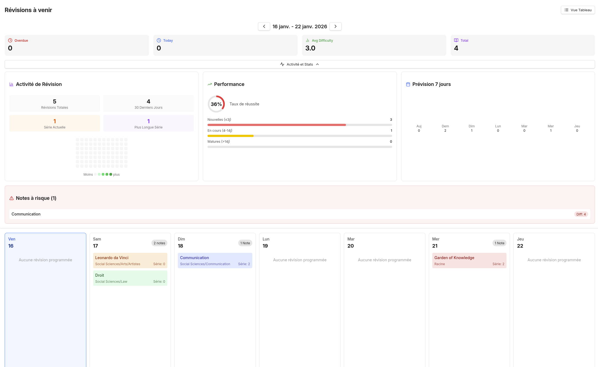

# Spaced Repetition Plugin for Obsidian

A spaced repetition system to help you retain information from your notes.



## Features

- Add any note to the review system
- Calendar view with weekly overview
- Review buttons with keyboard shortcuts (1-4)
- Activity heatmap and statistics
- Overdue notes tracking
- Multi-language support (EN, FR, ES, DE, JA)

## Installation

1. Copy `main.js`, `manifest.json`, and `styles.css` to your vault:
   ```
   .obsidian/plugins/spaced-repetition/
   ```
2. Enable the plugin in Obsidian settings

## Usage

- **Add a note**: Click the ribbon icon or use `Ctrl+Shift+R`
- **Review**: Open the calendar view and click on a note
- **Rate difficulty**: Use buttons or keyboard (1=Again, 2=Hard, 3=Good, 4=Easy)

## Algorithm

| Rating | Effect |
|--------|--------|
| Again | Reset interval to 1 day |
| Hard | Reduce interval by 20% |
| Good | Increase interval by 50% |
| Easy | Double the interval |

## License

MIT
